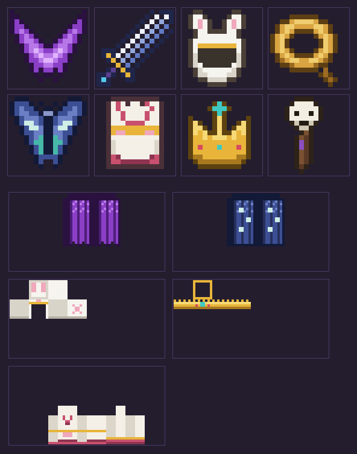

# MythGear — 八神装備パック

ボクセル調の8体のキャラクター(参照イラスト)が身につけている装備を、Minecraft Java版の
**データパック + リソースパック** として実装したものです。MOD不要、バニラのまま動きます。



## 対応バージョン

**Minecraft Java Edition 1.21.4 以降**(1.21.5〜1.21.x でも動作する構文に統一しています)

- `minecraft:item_model` / `minecraft:equippable`(カスタム装備アセット)/ `minecraft:attribute_modifiers` を使用
- 1.21.5 で仕様が変わった要素(テキストコンポーネントのSNBT化、`enchantments` のフラット化、
  `click_event` への改名など)は使わない書き方に寄せているため、1.21.4 と 1.21.5+ の両方で読み込めます

## 導入方法

1. `mythgear_datapack` フォルダをワールドの `datapacks/` に入れる
   (シングルなら `.minecraft/saves/<ワールド名>/datapacks/`)
2. `mythgear_resourcepack` フォルダを `.minecraft/resourcepacks/` に入れて、
   設定 → リソースパックで有効化する
3. ワールドに入って `/reload`(または入り直し)
4. チャットに `[MythGear] 八神装備パックを読み込みました。` と出れば成功

> フォルダのまま入れても、フォルダの中身を zip に固めて入れてもどちらでも認識されます。

## 装備一覧

| # | 装備 | 元キャラ(画像内) | ベース | 効果 |
|---|------|--------------------|--------|------|
| 壱 | 魔翼『ノクスウィング』 | 左上・蝙蝠翼の魔女 | エリトラ | 滑空 / 防具+3 |
| 弐 | 覇王大剣『ドラグヴェイン』 | 上段中央・大剣の剣士 | ネザライトの剣 | 攻撃力12 / 攻撃速度1.1 |
| 参 | 月兎の頭巾『ルナミミ』 | 右上・白髪の兎神 | 革の帽子 | 防具+2 / 落下耐性+4 / 跳躍力+ |
| 肆 | 黄金の投げ縄『ソルレイド』 | 中段左・茶髪の狩神 | リード | ノックバック+2 / 攻撃+2 |
| 伍 | 蛾神の羽『モスヴェール』 | 中段右・蛾の女神 | エリトラ | 滑空 / 防具+2 / 移動速度+10% |
| 陸 | 緋薔薇の羽織『ロゼクロス』 | 下段左・紅髪の武神 | 革の上着 | 防具+5 / 最大体力+1♥ |
| 漆 | 太陽神の宝冠『ソルクラウン』 | 下段中央・太陽神 | 金のヘルメット | 防具+3 / 幸運+1 |
| 捌 | 髑髏の呪杖『ネクロロッド』 | 下段右・呪術師 | ブレイズロッド | 攻撃力7 / 間合い+1 |

翼・頭巾・宝冠・羽織は装備すると**着用時の見た目も専用テクスチャ**になります
(`equippable` の `asset_id` によるカスタム装備アセット)。

## 入手方法

### コマンドで入手

```mcfunction
/function mythgear:give/all            # 全装備を一括入手
/function mythgear:give/demon_wings    # 個別入手 (give/<装備ID>)
```

装備ID: `demon_wings` / `hero_greatsword` / `moon_rabbit_hood` / `golden_lasso` /
`moth_wings` / `rose_robe` / `sun_crown` / `skull_staff`

### クラフトで入手

全装備に作業台レシピがあります(レシピブックには自動登録されます)。

| 装備 | レシピ(3×3) |
|------|--------------|
| 魔翼 | 中央にエリトラ、左右にファントムの皮膜、上にアメジストの欠片、下に黒曜石 |
| 覇王大剣 | 中央にネザライトの剣、上下…上にダイヤ・左右にダイヤ・下に金インゴット |
| 月兎の頭巾 | 革の帽子を白い羊毛で囲い、下中央に金インゴット |
| 黄金の投げ縄 | リードを金塊8個で囲う |
| 蛾神の羽 | 中央にエリトラ、左右にファントムの皮膜、上にラピスラズリ、下に輝くイカスミ |
| 緋薔薇の羽織 | 中央に革の上着、左右に赤の羊毛、上に白の羊毛2、下に金・白羊毛・金 |
| 太陽神の宝冠 | 金のヘルメットの上段に 金・ダイヤ・金 |
| 髑髏の呪杖 | 縦一列に ウィザースケルトンの頭蓋骨 / ブレイズロッド / 金インゴット |

正確な配置は `mythgear_datapack/data/mythgear/recipe/*.json` を参照してください。

## フォルダ構成

```
minecraft/
├── mythgear_datapack/        # データパック (give関数・レシピ・レシピ解放進捗)
│   └── data/mythgear/
│       ├── function/give/    # give/all + 装備ごとのgive関数
│       ├── function/load.mcfunction
│       ├── recipe/           # クラフトレシピ (結果にコンポーネント付与)
│       └── advancement/      # レシピブック自動登録用の隠し進捗
├── mythgear_resourcepack/    # リソースパック
│   └── assets/mythgear/
│       ├── items/            # アイテム定義 (item_model の参照先)
│       ├── models/item/      # アイテムモデル
│       ├── textures/item/    # アイコン (16x16)
│       ├── equipment/        # 着用時装備アセット定義
│       └── textures/entity/equipment/  # 着用時テクスチャ (wings / humanoid)
├── tools/generate.mjs        # 全ファイルの生成スクリプト
└── preview.png               # アイコン/テクスチャのプレビュー
```

## テクスチャや性能を変えたい場合

パック内のファイルは全て `tools/generate.mjs` から生成しています。
アイコンのドット絵(ASCIIアート形式)、装備の性能(`ITEMS` 配列)、レシピを編集して:

```bash
node minecraft/tools/generate.mjs
```

を実行すると、データパック・リソースパック・プレビューが再生成されます。
依存パッケージはありません(Node.js のみで動作)。
